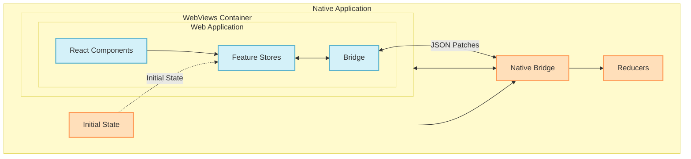

# 🌉 @open-game-system/store-bridge 🔄

A universal bridge that connects web games and the OpenGame App through a shared state store.

[](https://www.npmjs.com/package/@open-game-system/store-bridge)
[](https://www.typescriptlang.org/)
[](LICENSE)

## 🔄 TypeScript-First Approach

This library uses a TypeScript-first approach, exporting TypeScript source files directly without a build step. This offers several benefits:

- **Enhanced Type Safety**: Consume the library with full TypeScript type information.
- **Simplified Integration**: Import TypeScript files directly, no need to deal with a build step.
- **Improved Developer Experience**: Better IDE support with direct access to source files.
- **Type Compatibility**: Avoid version mismatches between your TypeScript version and the library's compiled output.

To use the library with this approach, simply install it and import from the module paths:

```typescript
// Import directly from TypeScript source
import { createBridge } from '@open-game-system/store-bridge';
import { createClientBridge } from '@open-game-system/store-bridge/client';
import type { Store } from '@open-game-system/store-bridge/types';
```

## 📋 Table of Contents

- [Overview](#-overview)
- [Installation](#-installation)
- [Key Features](#-key-features)
- [Getting Started](#-getting-started)
  - [Step 1: Define Your State and Event Types](#step-1-define-your-state-and-event-types)
  - [Step 2: Define Your Reducers (Native Side Only)](#step-2-define-your-reducers-native-side-only)
  - [Step 3: Create a Bridge Context in Your Web App](#step-3-create-a-bridge-context-in-your-web-app)
  - [Step 4: Create Store Contexts for Your Features](#step-4-create-store-contexts-for-your-features)
  - [Step 5: Access Store State in Feature Components](#step-5-access-store-state-in-feature-components)
- [React Hooks API Reference](#-react-hooks-api-reference)
  - [useStore](#usestore)
  - [useSelector](#useselector)
  - [useBridge](#usebridge)
  - [Store Availability Safety](#%EF%B8%8F-important-store-availability-safety)
- [React Integration API Reference](#-react-integration-api-reference)
  - [createBridgeContext](#createbridgecontext)
  - [createStoreContext](#createstorecontext)
  - [State Components](#state-components)
  - [Component State Relationships](#component-state-relationships)
- [Testing with Store Bridge](#-testing-with-store-bridge)
  - [Creating Mock Bridges and Stores](#creating-mock-bridges-and-stores)
  - [Basic React Testing Example](#basic-react-testing-example)
- [Package Structure](#-package-structure)
- [Development Status](#-development-status)

## 📋 Overview

The OpenGame Store Bridge creates a seamless bridge between web games and the OpenGame App, with different interfaces appropriate for each environment:

- **Web Side**: Web applications use a standard store interface with `getState()`, `dispatch()`, and `subscribe()` to interact with the state. Events dispatched from the web are processed on the native side.

- **Native Side**: As the host environment, the native application has both the standard interface and a more direct way to update state using the `produce` method.

The bridge handles all cross-environment communication transparently, ensuring both sides maintain a consistent view of the application state, regardless of which side initiated the change.



## 📦 Installation

```bash
# NPM
npm install @open-game-system/store-bridge

# Yarn
yarn add @open-game-system/store-bridge
```

> **Note**: This library is distributed as TypeScript source files. Your project will compile the TypeScript code along with your application. This approach provides better type safety, editor support, and allows the library to adapt to your project's TypeScript configuration.

## ✨ Key Features

- 🔄 **Appropriate Interfaces**: Standard store API for web, additional capabilities for native side
- 🔀 **Bidirectional Updates**: Both web and native sides can trigger state changes
- 🔑 **Key-Based Feature Isolation**: Each feature has its own isolated store with unique keys
- 📦 **Efficient Synchronization**: Use JSON patches for minimal data transfer between environments
- 📝 **Type-Safe Communication**: Comprehensive TypeScript definitions for all components
- 🔍 **Environment Detection**: Automatically detect if running in WebView or browser
- 🧭 **Prefix-Based Routing**: Route state changes to appropriate handlers based on key prefixes
- 🌊 **Graceful Degradation**: Handle running in both WebView and standalone browser contexts
- ⚛️ **React Integration**: First-class React support with context providers and hooks

## 🚀 Getting Started

Follow these steps to integrate the store-bridge into your application:

### Step 1: Define Your State and Event Types

First, define your feature's state and event types:

```typescript
// types.ts

// Define feature state type
type MyFeatureState = {
  isActive: boolean;
  status: string;
  sessionId: string;
};

// Define feature event types using discriminated unions
// No need to include requestId - it's handled by the library
type MyFeatureEvent = 
  | { type: "activate"; id: string }
  | { type: "deactivate" };

// Create a store type that combines state and events
type MyFeatureStore = {
  state: MyFeatureState;
  events: MyFeatureEvent;
};

// Define another feature's types
type AnotherFeatureState = {
  connected: boolean;
  users: string[];
};

type AnotherFeatureEvent = 
  | { type: "CONNECT" }
  | { type: "DISCONNECT" };

type AnotherFeatureStore = {
  state: AnotherFeatureState;
  events: AnotherFeatureEvent;
};

// Combine all your feature stores
interface BridgeStores {
  myFeature: MyFeatureStore;
  anotherFeature: AnotherFeatureStore;
}

// Export these types for use in other files
export type {
  MyFeatureState,
  MyFeatureEvent,
  MyFeatureStore,
  AnotherFeatureState,
  AnotherFeatureEvent,
  AnotherFeatureStore,
  BridgeStores
};
```

### Step 2: Define Your Reducers (Native Side Only)

Reducers are only used on the native side where state updates occur. You can create them in two ways:

```typescript
// reducers.ts
import { produce } from '@open-game-system/store-bridge/utils';
import type { 
  MyFeatureState, 
  MyFeatureEvent,
  AnotherFeatureState,
  AnotherFeatureEvent
} from './types';

// Option 1: Using produce for immutable updates (recommended)
export const myFeatureReducer = (state: MyFeatureState, event: MyFeatureEvent): MyFeatureState => {
  return produce(state, draft => {
    switch (event.type) {
      case "activate":
        draft.isActive = true;
        draft.status = 'active';
        break;
      case "deactivate":
        draft.isActive = false;
        draft.status = 'idle';
        break;
    }
  });
};

// Option 2: Using traditional immutable updates with spread operator
export const anotherFeatureReducer = (state: AnotherFeatureState, event: AnotherFeatureEvent): AnotherFeatureState => {
  switch (event.type) {
    case "CONNECT":
      return {
        ...state,
        connected: true
      };
    case "DISCONNECT":
      return {
        ...state,
        connected: false
      };
    default:
      return state;
  }
};
```

### Step 3: Create a Bridge Context in Your Web App

In your web application, create a bridge context using the `createBridgeContext` function:

```typescript
// bridge.ts - Bridge context creation
import { createBridgeContext } from '@open-game-system/store-bridge/react';
import type { BridgeStores } from './types';

// Create a bridge context with your store types
const BridgeContext = createBridgeContext<BridgeStores>();

// Export for usage in other files
export { BridgeContext };
```

Using the bridge context in your application:

```tsx
// App.tsx - Simplified version
import React from 'react';
import { BridgeContext } from './bridge';
import { MainContent } from './components/MainContent';

export function App() {
  return (
    <BridgeContext.Provider>
      {/* A bridge will be created automatically */}
      <MainContent />
    </BridgeContext.Provider>
  );
}
```

### Step 4: Create Store Contexts for Your Features

Now, create contexts for each feature store using the `createStoreContext` method from your bridge context:

```typescript
// contexts.ts - Create store contexts
import { BridgeContext } from './bridge';

// Create contexts for specific feature stores
export const MyFeatureContext = BridgeContext.createStoreContext('myFeature');
export const AnotherFeatureContext = BridgeContext.createStoreContext('anotherFeature');

// UI components for different states (optional)
export const UnavailableMessage = ({ text }: { text: string }) => (
  <div className="unavailable-message">{text}</div>
);

export const LoadingSpinner = ({ text }: { text: string }) => (
  <div className="loading-spinner">
    <div className="spinner" />
    <p>{text}</p>
  </div>
);
```

Using these contexts in your app:

```tsx
// components/MainContent.tsx
import React from 'react';
import { BridgeContext } from '../bridge';
import { 
  MyFeatureContext, 
  AnotherFeatureContext,
  UnavailableMessage,
  LoadingSpinner
} from '../contexts';
import { MyFeatureComponent } from './MyFeatureComponent';
import { AnotherFeatureComponent } from './AnotherFeatureComponent';

export function MainContent() {
  return (
    <div className="app-content">
      {/* Global fallback for unsupported environment */}
      <BridgeContext.Unsupported>
        <div className="bridge-unavailable">
          <h2>OpenGame App Required</h2>
          <p>These features require the OpenGame App environment.</p>
        </div>
      </BridgeContext.Unsupported>
      
      {/* Feature contexts already check for bridge support */}
      <section>
        <h2>My Feature</h2>
        <MyFeatureContext.Initializing>
          <LoadingSpinner text="Connecting to feature..." />
        </MyFeatureContext.Initializing>
        
        <MyFeatureContext.Initialized>
          <MyFeatureComponent />
        </MyFeatureContext.Initialized>
      </section>
      
      <section>
        <h2>Another Feature</h2>
        <AnotherFeatureContext.Initializing>
          <LoadingSpinner text="Initializing feature..." />
        </AnotherFeatureContext.Initializing>
        
        <AnotherFeatureContext.Initialized>
          <AnotherFeatureComponent />
        </AnotherFeatureContext.Initialized>
      </section>
    </div>
  );
}
```

## 📚 React Hooks API Reference

The store-bridge provides React hooks for accessing your stores in a type-safe and efficient manner through the context pattern.

### Core Types and Interfaces

First, let's understand the core interfaces:

```typescript
// Basic store interface
interface Store<State, Event> {
  getState(): State;
  dispatch(event: Event): void;
  subscribe(listener: (state: State) => void): () => void;
}

// Store definition with state and event types
interface StoreDefinition<State, Event> {
  state: State;
  events: Event;
}

// Map of store keys to their definitions
type BridgeStores = Record<string, StoreDefinition<any, any>>;
```

### useStore

```tsx
// ✅ ONLY USE WITHIN .Initialized COMPONENTS
function Component() {
  // ERROR if used outside of MyFeatureContext.Initialized
  const store = MyFeatureContext.useStore();
  
  // Now you can safely use the store methods:
  // - store.getState() - get current state
  // - store.dispatch() - dispatch events
  // - store.subscribe() - subscribe to state changes
  
  // Example:
  return (
    <button onClick={() => store.dispatch({ type: 'activate', id: 'session-123' })}>
      Activate
    </button>
  );
}
```

**Important**: This hook will throw an error if used outside of an `.Initialized` component. The error message will be something like: "Cannot use useStore outside of a \<MyFeatureContext.Initialized\> component".

### useSelector

```tsx
// ✅ ONLY USE WITHIN .Initialized COMPONENTS
function Component() {
  // ERROR if used outside of MyFeatureContext.Initialized
  const isActive = MyFeatureContext.useSelector(state => state.isActive);
  const status = MyFeatureContext.useSelector(state => state.status);
  
  // Now you can safely use the selected state
  return (
    <div>
      <h3>Active: {isActive ? 'Yes' : 'No'}</h3>
      <p>Status: {status}</p>
    </div>
  );
}
```

**Important**: This hook will throw an error if used outside of an `.Initialized` component. The error message will be similar to the one from `useStore`.

### useBridge

```tsx
// Import the context
import { BridgeContext } from './bridge';

function Component() {
  // Get the bridge instance
  const bridge = BridgeContext.useBridge();
  
  // Now you can use bridge methods
  const isSupported = bridge.isSupported();
  
  return (
    <div>
      <h3>Running in OpenGame App: {isSupported ? 'Yes' : 'No'}</h3>
    </div>
  );
}
```

**Important**: This hook will throw an error if used outside of a `BridgeContext.Provider` component.

### ⚠️ Important: Store Availability Safety

The store hooks don't automatically enforce safety rules - you need to handle store availability correctly to prevent runtime errors:

```tsx
// ❌ This will cause runtime errors if the store isn't available
function UnsafeComponent() {
  // If store is null/undefined, this will crash at runtime
  const store = MyFeatureContext.useStore(); 
  
  // This code will error if store doesn't exist
  return <div>This crashes if store isn't available</div>;
}

// ✅ The correct way: Only access store inside Initialized component
function SafeFeatureUsage() {
  return (
    <>
      <BridgeContext.Unsupported>
        <FallbackContent />
      </BridgeContext.Unsupported>
      
      {/* Feature contexts already check bridge support */}
      <MyFeatureContext.Initializing>
        <LoadingIndicator />
      </MyFeatureContext.Initializing>
      
      <MyFeatureContext.Initialized>
        {/* Store is guaranteed to exist here */}
        <ComponentThatUsesStore />
      </MyFeatureContext.Initialized>
    </>
  );
}

// This component is only rendered when the store is ready
function ComponentThatUsesStore() {
  // Safe to use because we're inside .Initialized
  const store = MyFeatureContext.useStore();
  return <div>Using store safely</div>;
}
```

Best practices for working with stores:

1. **Always use helper components**: Wrap components that use the store in `.Initialized` components.
2. **Provide fallbacks**: Use `.Initializing` and `.Unsupported` to handle all possible states.
3. **Colocate store access**: Keep store access logic close to where it's used, rather than passing store references down props.
4. **Use selectors for performance**: Prefer `useSelector` for accessing specific parts of state to minimize re-renders.

## 📘 React Integration API Reference

The React Integration layer provides context factories and hooks for using bridges and stores in React components.

### createBridgeContext

Creates the top-level bridge context with helper components, hooks, and a store context factory:

```typescript
import { createBridgeContext } from '@open-game-system/store-bridge/react';
import type { BridgeStores } from './types';

// Create a bridge context with your store types
const BridgeContext = createBridgeContext<BridgeStores>();

// The returned object includes:
// - Provider: React component that creates a bridge automatically by default
// - Supported: Component that renders children only when bridge is supported
// - Unsupported: Component that renders children when bridge is unavailable
// - useBridge: Hook to access the bridge instance
// - createStoreContext: Function to create store contexts for specific features
```

The `Provider` component can be used in two ways:

1. With an automatically created bridge (recommended for normal use):
```tsx
// The provider will create a bridge automatically - this is the recommended approach
<BridgeContext.Provider>
  {/* Your app */}
</BridgeContext.Provider>
```

2. With an explicit bridge (primarily for testing and mocking):
```tsx
import { createMockBridge } from '@open-game-system/store-bridge/testing';

// For testing/mocking in environments like Jest or Storybook
const mockBridge = createMockBridge<BridgeStores>({
  isSupported: true,
  stores: {
    myFeature: {
      initialState: { /* test state */ }
    }
  }
});

// Used mainly in testing scenarios
<BridgeContext.Provider bridge={mockBridge}>
  {/* Components under test */}
</BridgeContext.Provider>
```

In production code, you rarely need to create and pass a bridge explicitly. The Provider will handle this for you automatically.

### createStoreContext

Create store contexts for specific features using the `createStoreContext` method from your bridge context:

```typescript
// After creating a bridge context
const BridgeContext = createBridgeContext<BridgeStores>();

// Create a store context for a specific feature
const MyFeatureContext = BridgeContext.createStoreContext('myFeature');
```

Each store context provides:

1. Two component types:
   - `Initializing`: Children render when the bridge is available but the store is still loading
   - `Initialized`: Children render when the store is ready for use

2. Two hooks:
   - `useStore`: Returns the store instance
   - `useSelector`: Efficiently accesses specific parts of state with memoization

3. A Provider component (exclusively for testing):
   - `Provider`: Takes a required `store` prop to bypass the bridge and directly inject a store
   - This is not meant for typical application usage - only for testing scenarios

**Important**: In normal application code, you never need to use the store context's Provider component. Use the `BridgeContext.Provider` instead, which automatically connects to all stores.

### State Components

The bridge context provides helper components:

```tsx
// Import the BridgeContext
import { BridgeContext } from './bridge';

// For unsupported environments (web browsers, etc)
<BridgeContext.Unsupported>
  <p>This feature requires the OpenGame App</p>
</BridgeContext.Unsupported>

// For supported environments (within OpenGame App)
<BridgeContext.Supported>
  <p>You're using the OpenGame App!</p>
</BridgeContext.Supported>
```

Each store context provides two components to handle different states:

```tsx
// Import a feature context
import { MyFeatureContext } from './contexts';

// For when the store is still initializing
<MyFeatureContext.Initializing>
  <LoadingSpinner text="Connecting..." />
</MyFeatureContext.Initializing>

// For when the store is ready
<MyFeatureContext.Initialized>
  {/* Store is guaranteed to be available here */}
  <FeatureContent />
</MyFeatureContext.Initialized>
```

**Important**: Store contexts automatically check for bridge support, so you don't need to wrap them in `BridgeContext.Supported` in most cases.

### Component State Relationships

Here's how the different component states work together:

```
BridgeContext.Unsupported: Active when bridge is unavailable
Feature contexts: Only try to initialize when bridge is available

MyFeatureContext.Initializing: Active when bridge is supported but store isn't ready
MyFeatureContext.Initialized: Active when bridge is supported and store is ready
```

This means you typically only need to use `BridgeContext.Supported` when you want to render UI that depends on bridge support but isn't tied to any specific store.

## 🧪 Testing with Store Bridge

The `@open-game-system/store-bridge/testing` module provides several utilities to make testing components that use the store bridge straightforward and effective.

### Testing Utilities API Reference

#### createMockStore

Creates a mock store with a simplified implementation that can be used for testing.

```typescript
import { createMockStore } from '@open-game-system/store-bridge/testing';

// Create a basic mock store with initial state
const store = createMockStore<MyState, MyEvents>({
  initialState: { count: 0, name: 'Test' }
});

// The store has the standard store interface:
// - getState(): Returns the current state
// - dispatch(event): Records the event but does not modify state
// - subscribe(listener): Calls the listener with the state and returns an unsubscribe function
```

#### createMockStoreWithReducer

Creates a mock store that includes a reducer function for more realistic state updates during testing.

```typescript
import { createMockStoreWithReducer } from '@open-game-system/store-bridge/testing';

// Create a mock store with initial state and a reducer
const store = createMockStoreWithReducer<CounterState, CounterEvents>({
  initialState: { count: 0 },
  reducer: (state, event) => {
    switch (event.type) {
      case 'INCREMENT':
        return { ...state, count: state.count + 1 };
      case 'DECREMENT':
        return { ...state, count: state.count - 1 };
      default:
        return state;
    }
  }
});

// This store works like a real store:
// - getState(): Returns the current state
// - dispatch(event): Updates state using the reducer
// - subscribe(listener): Notifies listener when state changes
```

#### createMockBridge

Creates a mock bridge for testing components that depend on a bridge.

```typescript
import { createMockBridge } from '@open-game-system/store-bridge/testing';
import type { AppStores } from './types';

// Create a mock bridge with configuration
const mockBridge = createMockBridge<AppStores>({
  isSupported: true, // Configure whether the bridge reports as supported
  stores: {
    // Configure initial states and reducers for stores
    counter: {
      initialState: { count: 0 },
      reducer: (state, event) => {
        // Optional reducer for more realistic testing
        if (event.type === 'INCREMENT') {
          return { ...state, count: state.count + 1 };
        }
        return state;
      }
    },
    user: {
      initialState: { name: 'Test User', isLoggedIn: false }
    }
  }
});

// This mock bridge has the standard Bridge interface
// - isSupported(): Returns the configured supported status
// - getStore(key): Returns a mock store for the given key
```

#### createMockNativeBridge

Creates a mock native bridge that includes the `produce` method for testing components that use the native bridge features.

```typescript
import { createMockNativeBridge } from '@open-game-system/store-bridge/testing';
import type { AppStores } from './types';

// Create a mock native bridge
const mockNativeBridge = createMockNativeBridge<AppStores>({
  stores: {
    counter: {
      initialState: { count: 0 },
      reducer: (state, event) => {
        // Handle events
        return state;
      }
    }
  }
});

// Additional native bridge features:
// - produce(key, recipe): Update store state using an immutable recipe function
await mockNativeBridge.produce('counter', draft => {
  draft.count = 10;
});
```

### Testing React Components

Here's a complete example of how to test React components that use the bridge:

```tsx
import { render, screen, fireEvent } from '@testing-library/react';
import { createMockNativeBridge } from '@open-game-system/store-bridge/testing';
import { BridgeContext } from '../src/contexts/bridge';
import { CounterContext } from '../src/contexts/counter';
import { CounterComponent } from '../src/components/Counter';
import type { AppStores } from '../src/types';

test('Counter component increments value correctly', async () => {
  // Create a mock bridge with a counter store
  const mockBridge = createMockNativeBridge<AppStores>({
    stores: {
      counter: {
        initialState: { count: 5 },
        reducer: (state, event) => {
          if (event.type === 'INCREMENT') {
            return { ...state, count: state.count + 1 };
          }
          return state;
        }
      }
    }
  });
  
  // Get the store to observe state changes
  const counterStore = await mockBridge.getStore('counter');
  
  // Render the component with the mock bridge
  render(
    <BridgeContext.Provider bridge={mockBridge}>
      <CounterContext.Initialized>
        <CounterComponent />
      </CounterContext.Initialized>
    </BridgeContext.Provider>
  );
  
  // Initial state should be rendered
  expect(screen.getByText('Count: 5')).toBeInTheDocument();
  
  // Click the increment button
  fireEvent.click(screen.getByText('Increment'));
  
  // Updated state should be rendered
  expect(screen.getByText('Count: 6')).toBeInTheDocument();
  
  // Store state should be updated
  expect(counterStore.getState().count).toBe(6);
  
  // Test the produce method (native bridge feature)
  await mockBridge.produce('counter', draft => {
    draft.count = 10;
  });
  
  // Component should reflect the produced state
  expect(screen.getByText('Count: 10')).toBeInTheDocument();
});
```

### Testing Components in Isolation

For testing individual components without a bridge, you can directly provide a mock store:

```tsx
import { render, screen } from '@testing-library/react';
import { createMockStore } from '@open-game-system/store-bridge/testing';
import { CounterDisplay } from '../src/components/CounterDisplay';
import { CounterContext } from '../src/contexts/counter';

test('CounterDisplay shows the correct count', () => {
  // Create a mock store with a specific state
  const mockStore = createMockStore({
    initialState: { count: 42 }
  });
  
  // Render with the Provider and Initialized components
  render(
    <CounterContext.Provider store={mockStore}>
      <CounterContext.Initialized>
        <CounterDisplay />
      </CounterContext.Initialized>
    </CounterContext.Provider>
  );
  
  // Check that the component shows the correct count
  expect(screen.getByText('Count: 42')).toBeInTheDocument();
});
```

### Testing Error Handling

The testing utilities also allow you to test how your components handle error cases:

```tsx
import { render, screen } from '@testing-library/react';
import { createMockBridge } from '@open-game-system/store-bridge/testing';
import { BridgeContext } from '../src/contexts/bridge';
import { FeatureComponent } from '../src/components/Feature';
import type { AppStores } from '../src/types';

test('FeatureComponent shows fallback UI when bridge is not supported', () => {
  // Create a mock bridge that is not supported
  const mockBridge = createMockBridge<AppStores>({
    isSupported: false
  });
  
  render(
    <BridgeContext.Provider bridge={mockBridge}>
      <FeatureComponent />
    </BridgeContext.Provider>
  );
  
  // Check that the fallback UI is shown
  expect(screen.getByText('This feature requires the OpenGame App')).toBeInTheDocument();
  
  // Check that the main feature content is not shown
  expect(screen.queryByText('Feature Content')).not.toBeInTheDocument();
});
```

## 📦 Package Structure

The store-bridge library is organized into several main directories:

- `/src` - Source code for the library
- `/dist` - Generated distribution files (after building)
- `/coverage` - Code coverage reports (after running tests)

## 🚧 Development Status

- ✅ Core API design and type definitions complete
- ✅ React integration components implemented
- ✅ JSON Patch-based synchronization
- ⚠️ Limited test coverage - expanding tests
- 🔜 Improved error handling and debug logging
- 🔜 Performance optimizations

## 🛠️ Building the Package

To build the package for local development:

```bash
npm install    # Install dependencies
npm run build  # Build the TypeScript code
```

## 📄 License

MIT
