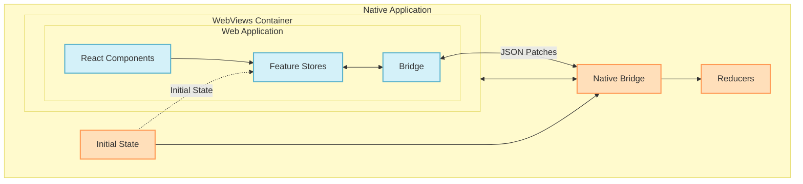

# 🌉 @open-game-system/store-bridge 🔄

A universal bridge that connects web games and the OpenGame App through a shared state store.

[](https://www.npmjs.com/package/@open-game-system/store-bridge)
[](https://www.typescriptlang.org/)
[](LICENSE)

## 📋 Table of Contents

- [Overview](#-overview)
- [Installation](#-installation)
- [Key Features](#-key-features)
- [Getting Started](#-getting-started)
  - [Step 1: Define Your State and Event Types](#step-1-define-your-state-and-event-types)
  - [Step 2: Define Your Reducers (Native Side Only)](#step-2-define-your-reducers-native-side-only)
  - [Step 3: Create a Bridge in Your Web App](#step-3-create-a-bridge-in-your-web-app)
  - [Step 4: Create a Bridge in Your Native App](#step-4-create-a-bridge-in-your-native-app)
  - [Step 5: Use React Integration with Helper Components](#step-5-use-react-integration-with-helper-components)
- [React Hooks API Reference](#-react-hooks-api-reference)
  - [useStore](#usestore)
  - [useSelector](#useselector)
  - [Correct Pattern for Using Hooks](#correct-pattern-for-using-hooks)
  - [Store Availability Safety](#️-important-store-availability-safety)
- [Store API Reference](#-store-api-reference)
- [Bridge API Reference](#-bridge-api-reference)
- [Type Safety and Serialization](#-type-safety-and-serialization)
- [Server-Side Rendering (SSR) Support](#-server-side-rendering-ssr-support)
  - [Validating External State](#validating-external-state)
  - [Generating Initial State on the Server](#generating-initial-state-on-the-server)
  - [Benefits of Built-in SSR Support](#benefits-of-built-in-ssr-support)
- [Testing with Store Bridge](#-testing-with-store-bridge)
  - [Creating Mock Bridges and Stores](#-creating-mock-bridges-and-stores)
  - [Basic React Testing Example](#-basic-react-testing-example)
  - [Store API Differences in Testing](#-store-api-differences-in-testing)
- [Package Structure](#-package-structure)

## 📋 Overview

The OpenGame Store Bridge creates a seamless bridge between web games and the OpenGame App, with different interfaces appropriate for each environment:

- **Web Side**: Web applications use a standard store interface with `getState()`, `dispatch()`, and `subscribe()` to interact with the state. Events dispatched from the web are processed on the native side.

- **Native Side**: As the host environment, the native application has both the standard interface and a more direct way to update state using the `produce` method.

The bridge handles all cross-environment communication transparently, ensuring both sides maintain a consistent view of the application state, regardless of which side initiated the change.



## 📦 Installation

```bash
# NPM
npm install @open-game-system/store-bridge

# Yarn
yarn add @open-game-system/store-bridge
```

> **Note**: This library is distributed as TypeScript source files. Your project will compile the TypeScript code along with your application. This approach provides better type safety, editor support, and allows the library to adapt to your project's TypeScript configuration.

## ✨ Key Features

- 🔄 **Appropriate Interfaces**: Standard store API for web, additional capabilities for native side
- 🔀 **Bidirectional Updates**: Both web and native sides can trigger state changes
- 🔑 **Key-Based Feature Isolation**: Each feature has its own isolated store with unique keys
- 📦 **Efficient Synchronization**: Use JSON patches for minimal data transfer between environments
- 📝 **Type-Safe Communication**: Comprehensive TypeScript definitions for all components
- 🔍 **Environment Detection**: Automatically detect if running in WebView or browser
- 🧭 **Prefix-Based Routing**: Route state changes to appropriate handlers based on key prefixes
- 🌊 **Graceful Degradation**: Handle running in both WebView and standalone browser contexts
- ⚛️ **React Integration**: First-class React support with context providers and hooks

## 🚀 Getting Started

Follow these steps to integrate the store-bridge into your application:

### Step 1: Define Your State and Event Types

First, define your feature's state and event types:

```typescript
// types.ts

// Define feature state type
type MyFeatureState = {
  isActive: boolean;
  status: string;
  sessionId: string;
};

// Define feature event types using discriminated unions
// No need to include requestId - it's handled by the library
type MyFeatureEvent = 
  | { type: "activate"; id: string }
  | { type: "deactivate" };

// Create a store type that combines state and events
type MyFeatureStore = {
  state: MyFeatureState;
  events: MyFeatureEvent;
};

// Define another feature's types
type AnotherFeatureState = {
  connected: boolean;
  users: string[];
};

type AnotherFeatureEvent = 
  | { type: "CONNECT" }
  | { type: "DISCONNECT" };

type AnotherFeatureStore = {
  state: AnotherFeatureState;
  events: AnotherFeatureEvent;
};

// Combine all your feature stores
interface BridgeStores {
  myFeature: MyFeatureStore;
  anotherFeature: AnotherFeatureStore;
}

// Export these types for use in other files
export type {
  MyFeatureState,
  MyFeatureEvent,
  MyFeatureStore,
  AnotherFeatureState,
  AnotherFeatureEvent,
  AnotherFeatureStore,
  BridgeStores
};
```

### Step 2: Define Your Reducers (Native Side Only)

Reducers are only used on the native side where state updates occur. You can create them in two ways:

```typescript
// reducers.ts
import { produce } from '@open-game-system/store-bridge/utils';
import type { 
  MyFeatureState, 
  MyFeatureEvent,
  AnotherFeatureState,
  AnotherFeatureEvent
} from './types';

// Option 1: Using produce for immutable updates (recommended)
export const myFeatureReducer = (state: MyFeatureState, event: MyFeatureEvent): MyFeatureState => {
  return produce(state, draft => {
    switch (event.type) {
      case "activate":
        draft.isActive = true;
        draft.status = 'active';
        break;
      case "deactivate":
        draft.isActive = false;
        draft.status = 'idle';
        break;
    }
  });
};

// Option 2: Using traditional immutable updates with spread operator
export const anotherFeatureReducer = (state: AnotherFeatureState, event: AnotherFeatureEvent): AnotherFeatureState => {
  switch (event.type) {
    case "CONNECT":
      return {
        ...state,
        connected: true
      };
    case "DISCONNECT":
      return {
        ...state,
        connected: false
      };
    default:
      return state;
  }
};
```

### Step 3: Create a Bridge in Your Web App

In your web application, create a bridge without reducers:

```typescript
// web-client.ts
import { createBridge } from '@open-game-system/store-bridge/client';
import type { BridgeStores } from './types';

// Create a bridge with your types (no reducers on web client)
const bridge = createBridge<BridgeStores>();

export async function initWebApp() {
  // Get a store for a feature (async - waits for initial state)
  const myFeatureStore = await bridge.getStore('myFeature');
  
  // Dispatch events with type safety (no requestId needed)
  myFeatureStore.dispatch({ 
    type: 'activate',
    id: 'session-123'
  });

  // Subscribe to state changes
  myFeatureStore.subscribe(state => {
    console.log('MyFeature state updated:', state);
  });

  // Get current state
  const currentState = myFeatureStore.getState();
  
  // Check if running in WebView
  const isInWebView = bridge.isInWebView();
  console.log(`Running in WebView: ${isInWebView}`);
}

export { bridge };
```

### Step 4: Create a Bridge in Your Native App

In your React Native application, create a bridge with reducers:

```typescript
// native-bridge.ts
import { createNativeBridge } from '@open-game-system/store-bridge/native';
import type { BridgeStores } from './types';
import { myFeatureReducer, anotherFeatureReducer } from './reducers';

// Create a native bridge with reducers (required on native side)
const bridge = createNativeBridge<BridgeStores>({
  // Reducers are required on the native side to process events from the web side
  reducers: {
    myFeature: myFeatureReducer,
    anotherFeature: anotherFeatureReducer
  }
});

export { bridge };
```

Using the bridge in a React Native component:

```tsx
// GameScreen.tsx
import React, { useRef, useEffect } from 'react';
import { View, Button, Text } from 'react-native';
import { WebView } from 'react-native-webview';
import { bridge } from './native-bridge';

interface GameScreenProps {
  sessionId: string;
}

export function GameScreen({ sessionId }: GameScreenProps) {
  const webViewRef = useRef<WebView>(null);
  
  useEffect(() => {
    if (webViewRef.current) {
      // Register this WebView for the store key
      bridge.registerWebView('myFeature', webViewRef.current);
      
      // Initialize the state for this key
      bridge.init('myFeature', {
        isActive: false,
        status: 'idle',
        sessionId
      });
      
      // Subscribe to state changes from the store on the native side
      const unsubscribe = bridge.getStore('myFeature').then(store => {
        return store.subscribe(state => {
          console.log('Native side received state update:', state);
        });
      });
      
      return () => {
        if (webViewRef.current) {
          bridge.unregisterWebView('myFeature', webViewRef.current);
        }
        // Clean up subscription
        unsubscribe.then(unsub => unsub());
      };
    }
  }, [webViewRef.current, sessionId]);
  
  // Native side can modify state directly using produce
  // This is more efficient than dispatching events on the native side
  const activateFromNative = async () => {
    const store = await bridge.getStore('myFeature');
    
    // Direct state mutation through produce (only available on native side)
    store.produce(draft => {
      draft.isActive = true;
      draft.status = 'active';
    });
    
    // The web application will automatically receive this state change
  };
  
  // Alternative approach using dispatch (standard interface)
  const activateViaEvent = async () => {
    const store = await bridge.getStore('myFeature');
    store.dispatch({
      type: 'activate',
      id: sessionId
    });
  };
  
  return (
    <View style={{ flex: 1 }}>
      <View style={{ padding: 10 }}>
        <Text>Native Controls</Text>
        <Button 
          title="Activate (Direct)" 
          onPress={activateFromNative} 
        />
        <Button 
          title="Activate (Via Event)" 
          onPress={activateViaEvent} 
        />
      </View>
      <WebView
        ref={webViewRef}
        source={{ uri: `https://example.com/game/${sessionId}` }}
        onMessage={event => bridge.processMessage(event)}
        style={{ flex: 1 }}
      />
    </View>
  );
}
```

### Step 5: Use React Integration with Helper Components

For React applications, we provide context providers and helper components:

```tsx
// App.tsx
import React from 'react';
import { 
  createBridgeContext, 
  BridgeProvider
} from '@open-game-system/store-bridge/react';
import { bridge } from './web-client';
import type { BridgeStores } from './types';

// Create contexts for specific store keys
const MyFeatureContext = createBridgeContext<BridgeStores>('myFeature');
const AnotherFeatureContext = createBridgeContext<BridgeStores>('anotherFeature');

// Components for different states
const UnavailableFeatureMessage = ({ text }: { text: string }) => (
  <div className="unavailable-message">{text}</div>
);

const LoadingSpinner = ({ text }: { text: string }) => (
  <div className="loading">
    <div className="spinner"></div>
    <p>{text}</p>
  </div>
);

// Main App component
export function App() {
  return (
    <BridgeProvider bridge={bridge}>
      <MainContent />
    </BridgeProvider>
  );
}

// Content component using helper components
function MainContent() {
  return (
    <div className="app-content">
      {/* Use helper components to handle different states declaratively */}
      
      {/* Example 1: MyFeature */}
      <section>
        <h2>My Feature</h2>
        
        <MyFeatureContext.Unavailable>
          {/* Rendered when not in WebView */}
          <UnavailableFeatureMessage text="This feature requires the OpenGame App." />
        </MyFeatureContext.Unavailable>
        
        <MyFeatureContext.Uninitialized>
          {/* Rendered when in WebView but store not ready yet */}
          <LoadingSpinner text="Connecting to feature..." />
        </MyFeatureContext.Uninitialized>
        
        <MyFeatureContext.Initialized>
          {/* Rendered when store is ready and state is available */}
          <MyFeatureComponent />
        </MyFeatureContext.Initialized>
      </section>
      
      {/* Example 2: AnotherFeature */}
      <section>
        <h2>Another Feature</h2>
        
        <AnotherFeatureContext.Initialized>
          <AnotherFeatureComponent />
        </AnotherFeatureContext.Initialized>
        
        <AnotherFeatureContext.Unavailable>
          <UnavailableFeatureMessage text="This feature requires the OpenGame App." />
        </AnotherFeatureContext.Unavailable>
      </section>
    </div>
  );
}

// Component using the store
function MyFeatureComponent() {
  // Get the store instance - typed correctly for the 'myFeature' key
  const store = MyFeatureContext.useStore();
  
  // Use selector to efficiently access specific state
  const isActive = MyFeatureContext.useSelector(state => state.isActive);
  
  const handleActivate = () => {
    store.dispatch({
      type: 'activate',
      id: 'session-123'
      // No requestId needed - handled by the library
    });
  };
  
  const handleDeactivate = () => {
    store.dispatch({
      type: 'deactivate'
    });
  };
  
  return (
    <div className="feature-component">
      <h3>Status: {isActive ? 'Active' : 'Inactive'}</h3>
      <div className="buttons">
        <button onClick={handleActivate}>Activate</button>
        <button onClick={handleDeactivate}>Deactivate</button>
      </div>
    </div>
  );
}

function AnotherFeatureComponent() {
  const connected = AnotherFeatureContext.useSelector(state => state.connected);
  const store = AnotherFeatureContext.useStore();
  
  return (
    <div className="feature-component">
      <h3>Connected: {connected ? 'Yes' : 'No'}</h3>
      <button 
        onClick={() => store.dispatch({ type: connected ? 'DISCONNECT' : 'CONNECT' })}
      >
        {connected ? 'Disconnect' : 'Connect'}
      </button>
    </div>
  );
}

export { MyFeatureContext, AnotherFeatureContext };
```

## 📚 React Hooks API Reference

The store-bridge provides React hooks for accessing your stores in a type-safe and efficient manner. These hooks are only available within the appropriate context providers and helper components.

### `useStore`

```tsx
// ✅ ONLY USE WITHIN .Initialized COMPONENTS
function Component() {
  // ERROR if used outside of MyFeatureContext.Initialized
  const store = MyFeatureContext.useStore();
  
  // Now you can safely use the store methods:
  // - store.getState() - get current state
  // - store.dispatch() - dispatch events
  // - store.subscribe() - subscribe to state changes
  
  // Example:
  return (
    <button onClick={() => store.dispatch({ type: 'activate', id: 'session-123' })}>
      Activate
    </button>
  );
}
```

**Important**: This hook will throw an error if used outside of an `.Initialized` component. The error message will be something like: "Cannot use useStore outside of a \<MyFeatureContext.Initialized\> component".

### `useSelector`

```tsx
// ✅ ONLY USE WITHIN .Initialized COMPONENTS
function Component() {
  // ERROR if used outside of MyFeatureContext.Initialized
  const isActive = MyFeatureContext.useSelector(state => state.isActive);
  const status = MyFeatureContext.useSelector(state => state.status);
  
  // Now you can safely use the selected state
  return (
    <div>
      <h3>Active: {isActive ? 'Yes' : 'No'}</h3>
      <p>Status: {status}</p>
    </div>
  );
}
```

**Important**: This hook will throw an error if used outside of an `.Initialized` component. The error message will be similar to the one from `useStore`.

### Correct Pattern for Using Hooks

Always follow this pattern when using the hooks:

```tsx
function MyFeatureSection() {
  return (
    <>
      {/* Only this component tree will have access to the store */}
      <MyFeatureContext.Initialized>
        <ComponentUsingHooks />
      </MyFeatureContext.Initialized>
      
      {/* Always provide fallbacks for other states */}
      <MyFeatureContext.Uninitialized>
        <LoadingSpinner text="Connecting to feature..." />
      </MyFeatureContext.Uninitialized>
      
      <MyFeatureContext.Unavailable>
        <UnavailableFeatureMessage text="This feature requires the OpenGame App." />
      </MyFeatureContext.Unavailable>
    </>
  );
}

// This component is guaranteed to have store access
function ComponentUsingHooks() {
  const store = MyFeatureContext.useStore();
  const isActive = MyFeatureContext.useSelector(state => state.isActive);
  
  // Safe to use store here
  return <div>...</div>;
}
```

This pattern ensures type safety and prevents runtime errors by guaranteeing that hooks are only used when the store is available and initialized.

### ⚠️ Important: Store Availability Safety

The bridge context hooks enforce strict safety rules to prevent runtime errors:

```tsx
// ❌ This will throw an error if used outside of an .Initialized component
function UnsafeComponent() {
  // ERROR: "Cannot use useStore outside of a <MyFeatureContext.Initialized> component"
  const store = MyFeatureContext.useStore(); 
  
  // Rest of component will never execute
  return <div>This won't render if the store isn't available</div>;
}

// ✅ The correct way: Only access store inside Initialized component
function SafeFeatureUsage() {
  return (
    <>
      <MyFeatureContext.Unavailable>
        <FallbackContent />
      </MyFeatureContext.Unavailable>
      
      <MyFeatureContext.Initialized>
        {/* Store is guaranteed to exist here */}
        <ComponentThatUsesStore />
      </MyFeatureContext.Initialized>
    </>
  );
}

// This component is only rendered when the store is ready
function ComponentThatUsesStore() {
  // Safe to use because we're inside .Initialized
  const store = MyFeatureContext.useStore();
  return <div>Using store safely</div>;
}
```

This enforcement ensures that you never attempt to access a store that doesn't exist, preventing runtime errors. It also encourages proper handling of different connection states.

Best practices for working with stores:

1. **Always use helper components**: Wrap components that use the store in `.Initialized` components.
2. **Provide fallbacks**: Use `.Uninitialized` and `.Unavailable` to handle all possible states.
3. **Colocate store access**: Keep store access logic close to where it's used, rather than passing store references down props.
4. **Use selectors for performance**: Prefer `useSelector` for accessing specific parts of state to minimize re-renders.

## 🔧 Store API Reference

Each feature store provides these methods:

```typescript
interface Store<State, Event> {
  // Get the current state
  getState(): State;
  
  // Dispatch an event to update state
  // Events are sent to the native side when in WebView
  dispatch(event: Event): void;
  
  // Subscribe to state changes
  // Returns an unsubscribe function
  subscribe(listener: (state: State) => void): () => void;
}
```

Example usage:

```typescript
// Get a store instance (from context or bridge)
const store = await bridge.getStore('myFeature');
// or within a React component:
const store = MyFeatureContext.useStore();

// Get current state
const state = store.getState();
console.log('Current active state:', state.isActive);

// Subscribe to changes
const unsubscribe = store.subscribe(newState => {
  console.log('State updated:', newState);
});

// Dispatch an event
store.dispatch({
  type: 'activate',
  id: 'session-123'
});

// Later: unsubscribe to prevent memory leaks
unsubscribe();
```

## 🌉 Bridge API Reference

The Bridge object provides these methods:

```typescript
interface Bridge<Stores extends Record<string, { state: any; events: any }>> {
  // Check if running inside a WebView
  isInWebView(): boolean;
  
  // Get a store for a specific key
  // Returns a promise that resolves when initial state is available
  getStore<K extends keyof Stores>(key: K): Promise<Store<Stores[K]['state'], Stores[K]['events']>>;
  
  // Get all store keys
  getStoreKeys(): (keyof Stores)[];
  
  // Check if a specific store is available
  hasStore(key: keyof Stores): boolean;
  
  // Force refresh all stores (rarely needed)
  refresh(): void;
}
```

Example usage:

```typescript
// Create a bridge
const bridge = createBridge<BridgeStores>();

// Check environment
if (bridge.isInWebView()) {
  console.log('Running inside the OpenGame App');
} else {
  console.log('Running in a normal browser');
}

// Get a store (async - waits for initial state)
const myFeatureStore = await bridge.getStore('myFeature');

// Check if a store exists
if (bridge.hasStore('specialFeature')) {
  const specialStore = await bridge.getStore('specialFeature');
  // use the store...
}

// Get all available store keys
const availableStores = bridge.getStoreKeys();
console.log('Available stores:', availableStores);
```

## 🔒 Type Safety and Serialization

Since state and events are passed across the web/native boundary via JSON serialization, it's important to ensure your types only contain serializable values:

```typescript
// types.ts
import { z } from 'zod';

// ❌ AVOID: Types with non-serializable values
type UnsafeState = {
  createdAt: Date;       // Date objects don't serialize correctly
  handler: () => void;   // Functions can't be serialized
  domElement: HTMLElement; // DOM elements can't be serialized
  complexData: Map<string, any>; // Maps, Sets don't serialize properly
};

// ✅ GOOD: Only use serializable types
type SafeState = {
  createdAt: string;     // ISO string for dates
  status: string;
  count: number;
  isActive: boolean;
  items: string[];       // Arrays are fine
  config: {              // Nested objects are fine
    theme: string;
    settings: {
      notifications: boolean;
    }
  }
};

// Using Zod to enforce serializable types
const SerializableStateSchema = z.object({
  createdAt: z.string(),
  status: z.string(),
  count: z.number(),
  isActive: z.boolean(),
  items: z.array(z.string()),
  config: z.object({
    theme: z.string(),
    settings: z.object({
      notifications: z.boolean()
    })
  })
});

// Use schema to validate that state is serializable
type SerializableState = z.infer<typeof SerializableStateSchema>;

// Helper function to validate state
function validateSerializableState(state: unknown): SerializableState {
  return SerializableStateSchema.parse(state);
}

// For type checking during development
type IsJSONSerializable<T> = 
  T extends string | number | boolean | null ? true :
  T extends Function | Symbol | undefined ? false :
  T extends Array<infer U> ? IsJSONSerializable<U> :
  T extends object ? { [K in keyof T]: IsJSONSerializable<T[K]> } extends { [K in keyof T]: true } ? true : false :
  false;

// Type assertion to check if your state is serializable
type AssertSerializable<T> = IsJSONSerializable<T> extends true ? T : never;

// Usage example:
type MyState = AssertSerializable<{
  name: string;
  count: number;
  // Will cause type error:
  // handler: () => void;
}>;
```

### Best Practices for Serialization Safety

1. **Only use plain data types**: strings, numbers, booleans, null, arrays, and plain objects
2. **Convert non-serializable data**: Use ISO strings for dates, IDs for complex objects, etc.
3. **Validate with Zod**: Define schemas and use them to validate data at runtime
4. **Use type helpers**: Create utility types to verify serialization compatibility 
5. **Test serialization**: Add tests that verify your state can be correctly serialized and deserialized

## 🔄 Server-Side Rendering (SSR) Support

While not a core requirement currently, the store-bridge has built-in support for server-side rendering (SSR). The `createBridge` API accepts an optional `initialState` parameter to hydrate stores with initial data:

```typescript
// client.ts
import { createBridge } from '@open-game-system/store-bridge/client';
import type { BridgeStores } from './types';
import { parseInitialState } from './utils';

// Get validated initial state from query parameters or other sources
const initialState = parseInitialState();

// Create a bridge with initial state
const bridge = createBridge<BridgeStores>({
  // Optional initial state for any store keys
  initialState
});

export { bridge };
```

### Validating External State

When accepting state from external sources like query parameters, it's important to validate it:

```typescript
// utils.ts
import { z } from 'zod';
import type { BridgeStores, MyFeatureState } from './types';

// Define Zod schemas for validating state from external sources
const MyFeatureStateSchema = z.object({
  isActive: z.boolean(),
  status: z.string(),
  sessionId: z.string()
});

// Make sure the schema matches your type definition
type MyFeatureStateFromSchema = z.infer<typeof MyFeatureStateSchema>;
// Type assertion to ensure schema matches your state type
type _TypeCheck = Omit<MyFeatureState, keyof MyFeatureStateFromSchema> &
                   Omit<MyFeatureStateFromSchema, keyof MyFeatureState>;

// Extract and validate state from query parameters
export function parseInitialState(): Partial<{
  [K in keyof BridgeStores]: { state: BridgeStores[K]['state'] }
}> {
  const params = new URLSearchParams(window.location.search);
  const serializedState = params.get('initialState');
  
  if (!serializedState) {
    return {};
  }
  
  try {
    // Parse the state
    const parsedState = JSON.parse(decodeURIComponent(serializedState));
    
    // Create a store-shaped object with validated state
    const initialState: Partial<{
      [K in keyof BridgeStores]: { state: BridgeStores[K]['state'] }
    }> = {};
    
    // Only add state that passes validation
    if (parsedState.myFeature) {
      const result = MyFeatureStateSchema.safeParse(parsedState.myFeature);
      if (result.success) {
        initialState.myFeature = {
          state: result.data
        };
      }
    }
    
    return initialState;
  } catch (error) {
    console.warn('Failed to parse initial state from query', error);
    return {};
  }
}
```

### Generating Initial State on the Server

On your server, generate a URL with the initial state embedded:

```typescript
// server.ts
import { encode } from 'querystring';

function generateGameUrl(gameId: string, initialState: any) {
  const baseUrl = 'https://example.com/game';
  const serializedState = encodeURIComponent(JSON.stringify(initialState));
  
  return `${baseUrl}/${gameId}?${encode({ initialState: serializedState })}`;
}

// Example usage in a route handler
app.get('/launch-game/:gameId', (req, res) => {
  const { gameId } = req.params;
  
  // Initial state for the game
  const initialState = {
    myFeature: {
      isActive: false,
      status: 'pending',
      sessionId: gameId
    }
  };
  
  // Generate a URL with embedded state
  const gameUrl = generateGameUrl(gameId, initialState);
  
  // Redirect to the game with initial state
  res.redirect(gameUrl);
});
```

### Benefits of Built-in SSR Support

1. **Performance**: Users see meaningful content immediately without waiting for API calls
2. **SEO**: Search engines can index your content more effectively
3. **User Experience**: Reduces perceived loading time and flickering
4. **Resilience**: App can function with predefined state even before bridge connection is established

The bridge will automatically use the initial state until a connection with the native side is established, at which point it will synchronize with the native state. This provides a seamless experience for users, even in environments with slow connections.

## 🧪 Testing with Store Bridge

The store-bridge provides testing utilities that make your components easy to test without real network calls.

### 📤 Creating Mock Bridges and Stores

There are two main testing utilities:

```typescript
// Import testing utilities
import { 
  createMockBridge, 
  createMockStore
} from '@open-game-system/store-bridge/testing';
import { 
  createBridgeContext,
  BridgeProvider
} from '@open-game-system/store-bridge/react';
import type { BridgeStores, MyFeatureStore } from './types';

// ✅ Creating a mock bridge (similar to the native bridge)
const mockBridge = createMockBridge<BridgeStores>({
  stores: {
    myFeature: {
      initialState: {
        isActive: false,
        status: 'idle',
        sessionId: 'test-session'
      }
      // No need to provide a reducer in most test cases
    }
  }
});

// ✅ Creating an individual mock store
const mockStore = createMockStore<MyFeatureStore['state'], MyFeatureStore['events']>({
  isActive: false,
  status: 'idle',
  sessionId: 'test-session'
});

// 🔑 Mock stores provide a special produce method for easy state updates
// This method is only available on mock stores (not on real stores)
mockStore.produce(draft => {
  draft.isActive = true;
  draft.status = 'active';
});

// The above is equivalent to dispatching events that would trigger these changes,
// but without needing to define and dispatch specific events
```

### 🔍 Basic React Testing Example

Here's a typical React testing pattern:

```typescript
describe('MyFeatureComponent', () => {
  it('renders and handles events correctly', async () => {
    // 1. Create a mock bridge with initial state
    const mockBridge = createMockBridge<BridgeStores>({
      stores: {
        myFeature: {
          initialState: {
            isActive: false,
            status: 'idle',
            sessionId: 'test-123'
          }
        }
      }
    });
    
    // 2. Create the context
    const MyFeatureContext = createBridgeContext<BridgeStores>('myFeature');
    
    // 3. Render with the mock bridge
    render(
      <BridgeProvider bridge={mockBridge}>
        <MyFeatureContext.Initialized>
          <MyFeatureComponent />
        </MyFeatureContext.Initialized>
      </BridgeProvider>
    );
    
    // 4. Get store to verify or manipulate state
    const store = await mockBridge.getStore('myFeature');
    
    // 5. Interact with component
    const activateButton = screen.getByText('Activate');
    userEvent.click(activateButton);
    
    // 6. Verify events were dispatched
    expect(store.getState().isActive).toBe(true);
    
    // 7. You can also directly modify state for testing different states
    store.produce(draft => {
      draft.status = 'paused';
    });
    
    // 8. Verify UI updated with new state
    expect(screen.getByText('Status: Paused')).toBeInTheDocument();
  });
});
```

### ⚙️ Store API Differences in Testing

Mock stores provide additional methods that make testing easier:

```typescript
// Standard store methods (available in both real and mock stores)
store.getState()    // Get current state
store.dispatch()    // Dispatch an event
store.subscribe()   // Subscribe to state changes

// Testing-only methods (only available in mock stores)
store.produce()     // Directly modify state using immer
store.setState()    // Completely replace the current state
store.resetState()  // Reset to initial state
```

The `produce` method is particularly useful for testing:

```typescript
// In a test:
it('shows error state correctly', async () => {
  // Set up component with the mock store
  const { mockBridge } = setupTest();
  const store = await mockBridge.getStore('myFeature');
  
  // Use produce to directly update state without dispatching events
  store.produce(draft => {
    draft.status = 'error';
    draft.errorMessage = 'Connection failed';
  });
  
  // Now test that your UI responds correctly to this state
  expect(screen.getByText('Error: Connection failed')).toBeInTheDocument();
});
```

This approach makes tests:
- **Simpler**: No need to mock complex event handlers or reducers
- **More focused**: Test UI state reactions without testing event logic
- **More maintainable**: Less likely to break when event handling changes

## 📦 Package Structure

```
@open-game-system/store-bridge/
├── client        # Web client implementations
├── native        # React Native implementations
├── react         # React integration with context providers
├── testing       # Testing utilities
├── types         # TypeScript type definitions
└── utils         # Shared utilities including produce function
```
